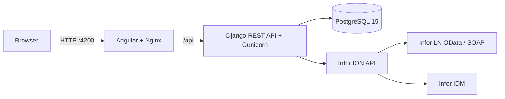

# MES Platform

[](https://github.com/MohamedAnasBenMim/MES/actions/workflows/ci.yml)
[](https://github.com/MohamedAnasBenMim/MES/actions/workflows/security.yml)
[](https://github.com/MohamedAnasBenMim/MES/actions/workflows/docker-build.yml)

A full-stack Manufacturing Execution System (MES) that connects shop-floor workflows with Infor CloudSuite LN. The platform supports production execution, operator supervision, quality reporting, warehouse visibility, user administration, and MES device management.

## Highlights

- Role-based workspaces for operators, supervisors, quality personnel, and administrators.
- Production dispatch and active-operation workflows integrated with Infor LN.
- Operation reporting with delivered/rejected quantities and performance scoring.
- Operator assignment, reassignment, removal, workload, and assignment history.
- Material consumption and inventory-issue initiation.
- Non-conformance reporting with Infor IDM attachments.
- Inventory, warehouse, and product/item visibility.
- User lifecycle, email verification, password recovery, session tracking, and device controls.
- User preferences for language, timezone, date format, theme, and profile image.
- Containerized local and production-style runtime with automated CI and security scans.

## Architecture



| Layer | Technology |
| --- | --- |
| Frontend | Angular 21, TypeScript, CoreUI, Angular Material, Chart.js |
| Backend | Python 3.11, Django, Django REST Framework, Gunicorn |
| Database | PostgreSQL 15 |
| Integration | Infor ION API, LN OData/SOAP, IDM |
| Runtime | Docker Compose, Nginx |
| Automation | GitHub Actions, Dependabot, pre-commit |
| Security | Gitleaks, pip-audit, npm audit, Trivy |

## Main modules

### Operator

- View the dispatch and active-operation lists.
- Start and execute production operations.
- Review and initiate material consumption.
- Report completed, delivered, and rejected quantities.
- Raise non-conformance reports and upload attachments.
- Review weekly productivity, quality score, points, and ranking.

### Supervisor

- View available operators and active production operations.
- Assign, reassign, or remove operators from operations.
- Review assignment history and current workloads.

### Quality and warehousing

- List and raise non-conformance reports.
- Browse stock-point inventory, warehouses, and item master data.
- Filter and paginate warehouse data retrieved from Infor LN.

### Administration

- Create, update, activate, deactivate, and delete users.
- Review roles and user-session activity.
- Manage ION API credentials and IDM configurations.
- Register, update, enable, and disable MES devices.
- Configure account preferences and security settings.

## Quick start with Docker

### Prerequisites

- Docker Engine
- Docker Compose v2

### 1. Clone the repository

```bash
git clone git@github.com:MohamedAnasBenMim/MES.git
cd MES
```

### 2. Create the environment file

```bash
cp .env.example .env
```

Replace all placeholder passwords and configure the email and security values required by your environment. Never commit `.env`. Infor ION credentials are managed through the application's administration interface after startup.

### 3. Start the platform

```bash
docker compose up --build -d
```

The backend waits for PostgreSQL, applies Django migrations, and then starts Gunicorn. The frontend starts after the backend health check succeeds.

### 4. Open the services

| Service | Address |
| --- | --- |
| MES frontend | <http://localhost:4200> |
| Django API | <http://localhost:8000/api/> |
| Health endpoint | <http://localhost:8000/api/health/> |
| PostgreSQL from host | `localhost:5433` |

### Useful commands

```bash
# Follow service logs
docker compose logs -f

# Show container and health status
docker compose ps

# Stop the platform while retaining database data
docker compose down

# Rebuild one application service
docker compose up --build -d backend
```

> `docker compose down -v` removes the PostgreSQL volume and its data. Use it only when a complete local reset is intended.

## Local development

### Backend

```bash
cd MES-Backend
python -m venv .venv
source .venv/bin/activate
pip install -r requirements.txt
python manage.py migrate
python manage.py runserver
```

The backend expects PostgreSQL and the variables documented in `.env.example`. When Django runs directly on the host while PostgreSQL runs through this Compose stack, use `DB_HOST=localhost` and `DB_PORT=5433`.

### Frontend

```bash
cd MES-Frontend
npm ci
npm start
```

## Quality and security

Every push and pull request to `main` runs automated checks:

- **Backend:** Ruff, Black, isort, Django checks, migration validation, and tests.
- **Frontend:** Angular tests in headless Chrome and a production build.
- **Security:** secret scanning, Python/npm dependency audits, and container-image scanning.
- **Images:** backend and frontend images are built and published to GHCR on pushes.

Install the local hooks before contributing:

```bash
python -m pip install pre-commit
pre-commit install
pre-commit run --all-files
```

## Repository structure

```text
MES/
├── MES-Backend/             # Django API and Infor integrations
├── MES-Frontend/            # Angular application and Nginx configuration
├── .github/workflows/       # CI, image publishing, and security pipelines
├── .env.example             # Safe environment-variable template
├── .pre-commit-config.yaml  # Local quality and security checks
└── docker-compose.yml       # Three-service application stack
```

## Production readiness

The repository includes the containerization and CI/DevSecOps foundation. A production deployment should additionally provide HTTPS termination, managed secrets, private database networking, scheduled and tested backups, centralized logs, monitoring and alerts, deployment approvals, and an automated rollback strategy.

See [SECURITY.md](SECURITY.md) for vulnerability reporting and [CONTRIBUTING.md](CONTRIBUTING.md) for the contribution workflow.

## License

The frontend is derived from the MIT-licensed CoreUI Angular template. See [MES-Frontend/LICENSE](MES-Frontend/LICENSE). Confirm the intended license for the complete repository before public redistribution.
